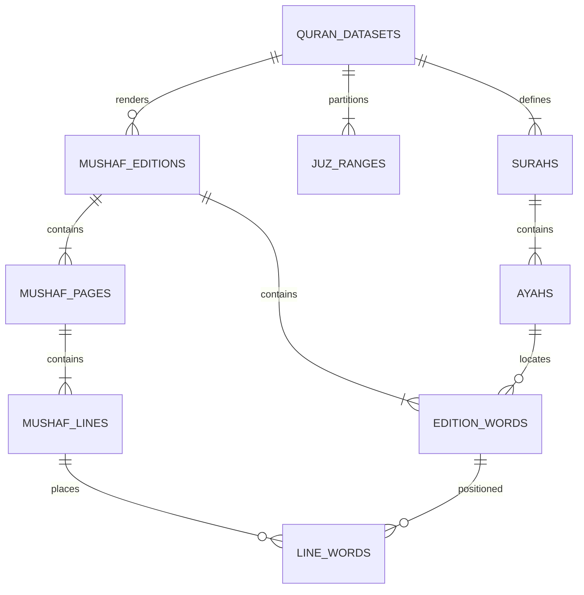
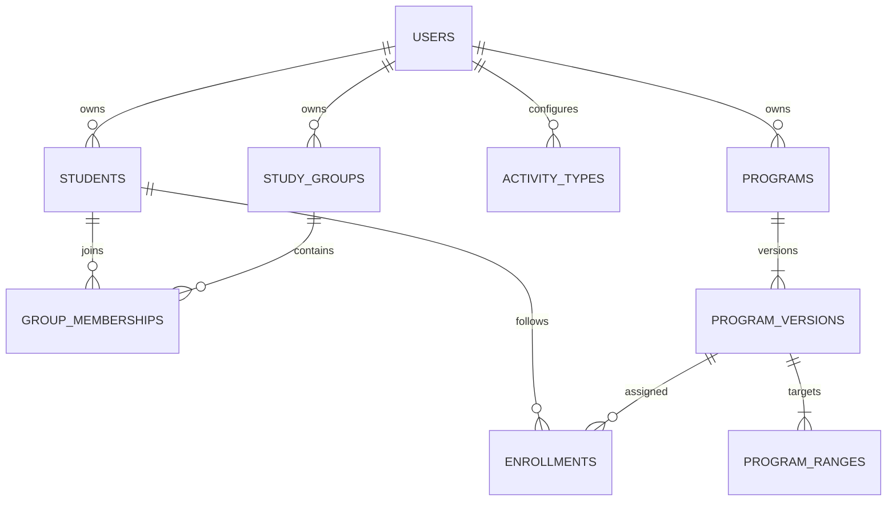
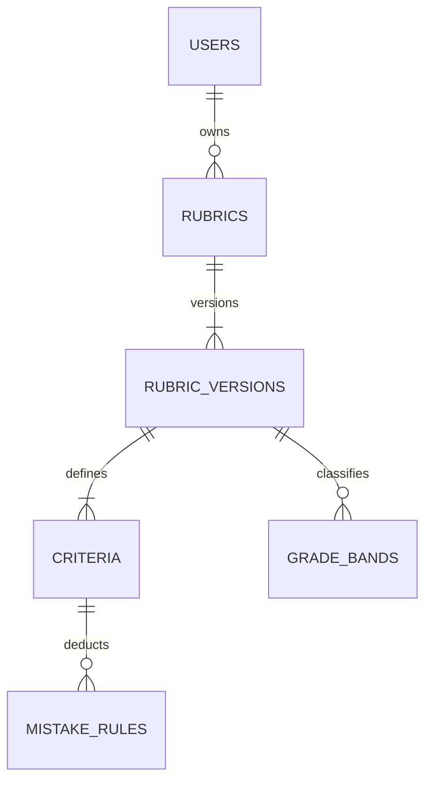
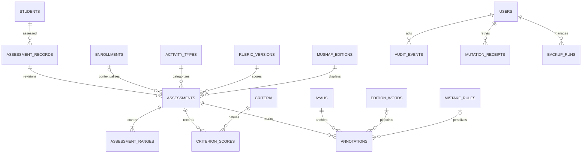

# ERD — Model Data Logis

Versi 0.3 · 21 September 2026. Tabel master F3, referensi ayat minimal, program, enrollment, serta rubrik F4 sudah memiliki migration; tabel edisi mushaf dan sesi penilaian masih rancangan. Kontrak perilaku: [PRD](PRD.md). Nama tabel berbahasa Inggris; UI berbahasa Indonesia.

## Konvensi

- `id`: identifier stabil (ULID untuk data aplikasi direkomendasikan); semua FK bertipe sama dengan parent.
- Tabel mutabel memiliki timestamps. Tabel berversi immutable setelah publish/final.
- `owner_id` FK users pada agregat milik guru. Child mewarisi ownership melalui parent; semua operasi lintas agregat memvalidasi pemilik sama.
- `?` pada kamus berarti nullable. Nomor ayat dan kata tidak dipakai sebagai ID global tanpa konteks sumber.
- Enum lifecycle/metode bukan konfigurasi pengguna. Label kegiatan, kriteria, kesalahan, dan predikat berasal dari tabel.
- Diagram membagi domain agar terbaca; kamus dan constraint di bawah melengkapi relasi yang tidak digambar.

## Referensi Al-Qur'an

| Tabel | Kolom utama / makna |
|---|---|
| quran_datasets | id, source_name, source_url, version, riwayah, license_metadata, checksum, validation_status |
| surahs | id, dataset_id, number, name_local, ayah_count; nama Arab menunggu impor sumber F2 |
| ayahs | id, dataset_id, surah_id, number, global_order, text_uthmani?; teks produksi menunggu F2 |
| juz_ranges | id, dataset_id, juz_number, start_ayah_id, end_ayah_id |
| mushaf_editions | id, dataset_id, name, version, script_source, font_source, layout_source, assets_manifest, license_metadata, checksum, status |
| edition_words | id, edition_id, ayah_id, position, source_word_key, text_or_glyph, token_kind |
| mushaf_pages | id, edition_id, page_number |
| mushaf_lines | id, page_id, line_number, line_type, alignment, surah_id? |
| line_words | id, line_id, edition_word_id, position |

Constraint: unique(dataset_id, surah number), unique(surah_id, ayah number), unique(dataset_id, juz_number), unique(edition_id, source_word_key), unique(edition_id, ayah_id, position), unique(edition_id, page_number), unique(page_id, line_number), unique(line_id, position). Global order harus unik dalam dataset (enforcement dengan FK dataset tambahan pada migration bila diperlukan).

Juz ranges dan seluruh ayat edisi harus berada pada dataset yang sama. Token nomor ayat/dekorasi dapat dimodelkan tetapi tidak boleh menjadi jangkar kesalahan kata bacaan. Mapping page/line tidak diasumsikan sama antar edisi. Import memeriksa kelengkapan, urutan, mapping silang, checksum, dan lisensi sebelum active.

## Santri dan program

| Tabel | Kolom utama / makna |
|---|---|
| users | id, name, email, password (hash Laravel), owner_slot=1 unik, timezone, preferences; satu pemilik pada MVP |
| students | id, owner_id, code, name, contact?, notes?, archived_at? |
| study_groups | id, owner_id, name, archived_at? |
| group_memberships | id, group_id, student_id, joined_at, left_at? |
| activity_types | id, owner_id, name, counts_toward_progress, archived_at? |
| programs | id, owner_id, name, archived_at? |
| program_versions | id, program_id, version, dataset_id, name_snapshot, description?, start_date?, target_date?, status, published_at? |
| program_ranges | id, program_version_id, start_ayah_id, end_ayah_id, sort_order |
| enrollments | id, student_id, program_id, program_version_id, active_student_id?, started_at, ended_at?, previous_enrollment_id? |

Unique(owner_id, student code), unique(program_id, version). `users.owner_slot` memiliki unique dan CHECK = 1 untuk menegakkan satu pemilik tanpa akun bawaan. Satu membership aktif per pasangan group/student, satu enrollment aktif per student/program root. Pindah versi mengakhiri enrollment lama dan membuat enrollment baru, tanpa menulis ulang sesi lama. Rentang inklusif menggunakan global_order dataset. Target adalah union ranges; urutan belajar tetap sort_order.

Implementasi F3 memakai ULID. `group_memberships.active_student_id` dan `enrollments.active_student_id` nullable; unique masing-masing `(group_id, active_student_id)` dan `(program_id, active_student_id)` mencegah duplikasi aktif pada MySQL. Baris historis bernilai null. Arsip santri/kelompok mengakhiri keanggotaan kelompok aktif tanpa menghapus histori. Arsip program mempertahankan versi dan enrollment, tetapi menutup perubahan baru. Tabel referensi minimal memungkinkan fixture sintetis pada database test; aplikasi belum mengaktifkan dataset produksi sampai F2 tervalidasi.

## Rubrik berversi

| Tabel | Kolom utama / makna |
|---|---|
| rubrics | id, owner_id, name, archived_at? |
| rubric_versions | id, rubric_id, version, name_snapshot, status, pass_threshold, calculation_version, published_at? |
| criteria | id, rubric_version_id, name, description?, method, min_score, max_score, weight, min_pass_normalized?, sort_order |
| mistake_rules | id, criterion_id, name, severity_label?, deduction_points |
| grade_bands | id, rubric_version_id, label, lower_bound, upper_bound |

Unique(rubric_id, version). Semua score/weight/threshold berupa DECIMAL; rekomendasi input DECIMAL(12,4), normalized/final DECIMAL(18,8), evaluasi dengan arithmetic decimal sebelum format tampilan. calculation_version memungkinkan reproduksi ketika engine berubah. Audit contoh hitung wajib saat menentukan presisi migration.

Validasi publish atomik: bobot total 100; max > min; threshold 0–100; deduction_points > 0; mistake_rules hanya pada deduction criteria; grade bands memenuhi CAP-03/04. Published parent beserta children dilarang update/delete. Retired tetap bisa dibaca oleh sesi lama.

Implementasi F4 menyimpan konfigurasi numerik sebagai `DECIMAL(12,4)` dan `calculation_version=1`. Service skor memakai BCMath pada presisi antara 12 desimal, mengevaluasi ambang/predikat sebelum format dua desimal, dan mengembalikan rincian potongan per kejadian. Pratinjau tidak menyimpan sesi atau nilai santri; tabel sesi penilaian tetap pekerjaan F5.

## Penilaian, revisi, dan audit

| Tabel | Kolom utama / makna |
|---|---|
| assessment_records | id, owner_id, student_id, current_final_id?, voided_at?, void_reason? |
| assessments | id, record_id, revision_number, previous_assessment_id?, enrollment_id?, activity_type_id, activity_name_snapshot, counts_toward_progress_snapshot, rubric_version_id, edition_id, status, assessed_at, lock_version, last_ayah_id?, notes?, revision_reason?, final_score?, passed?, grade_label_snapshot?, finalized_at? |
| assessment_ranges | id, assessment_id, kind (planned/actual), start_ayah_id, end_ayah_id, sort_order |
| criterion_scores | id, assessment_id, criterion_id, direct_input?, computed_raw?, override_raw?, override_reason?, normalized_score?, weighted_score? |
| annotations | id, assessment_id, ayah_id, edition_word_id?, kind (note/penalty), mistake_rule_id?, note?, retracted_at?, created_at |
| mutation_receipts | id, owner_id, mutation_id, resource_type, resource_id, request_hash, result_revision, result_reference, created_at, expires_at |
| audit_events | id, owner_id, actor_id, entity_type, entity_id, action, safe_metadata, created_at |
| backup_runs | id, owner_id, operation (backup/restore), status, storage_key?, manifest, checksum?, started_at, completed_at?, error_code?, pre_restore_backup_id? |

## Integritas transaksi

1. assessment_records.current_final_id FK assessments; validasi target memiliki record_id yang sama. Unique(record_id, revision_number); paling banyak satu draft revisi aktif per record.
2. previous_assessment_id harus revisi dari record yang sama; rantai tidak boleh melingkar. Finalisasi revisi mengunci record, memverifikasi current final belum berubah, mengganti pointer dan menandai hasil lama superseded dalam satu transaksi.
3. Sesi tanpa enrollment sah. Jika ada enrollment, student dan owner harus sama dengan record. Dataset program, ranges, ayat anotasi, dan edisi sesi harus cocok.
4. Unique(assessment_id, criterion_id). Criterion/rule wajib dari rubric_version sesi. Annotation word harus berasal dari edition sesi dan ayah yang sama.
5. Penalti membutuhkan mistake_rule_id; note tidak memilikinya. Penalti aktif berarti retracted_at null. Satu annotation = satu kejadian; retry tidak membuat kejadian baru.
6. Planned boleh beberapa ranges; actual wajib subset union planned dan tidak kosong saat final. Anotasi final wajib berada dalam actual. Jika cakupan dikurangi, UI meminta guru memindahkan/membatalkan anotasi di luar cakupan.
7. Draft menggunakan optimistic lock_version. Finalisasi memeriksa expected revision dan seluruh invariant lalu menghitung ulang pada server. Histori final immutable; void/supersede hanya transisi tercatat.
8. Unique(owner_id, mutation_id) pada receipts. Request hash berbeda untuk key sama ditolak. Receipt finalisasi harus bertahan selama record hidup; receipt autosave boleh kedaluwarsa dengan lock_version tetap mencegah replay stale.
9. Semua FK histori memakai RESTRICT, bukan cascade delete. Data aplikasi diarsipkan; penghapusan permanen/retensi memerlukan desain terpisah.
10. Constraints lintas tabel (owner/dataset/status/aggregate) divalidasi domain service dalam transaksi; gunakan composite FK/check/unique engine bila tersedia. Jangan menganggap foreign key tunggal cukup menjamin ownership.

## Query dan progres

- Indeks awal: students(owner_id, archived_at, name), assessments(record_id, status, assessed_at), annotations(assessment_id, retracted_at), annotations(ayah_id, mistake_rule_id), enrollments(student_id, ended_at), program_ranges(program_version_id), ayahs(surah_id, number), edition_words(edition_id, ayah_id, position).
- Laporan memilih current_final_id dari record yang tidak void; jangan menjumlah seluruh assessments berstatus pernah final.
- Hafalan unik: union actual ranges current final yang lulus dan counts_toward_progress_snapshot true, intersection dengan target program version. Sesi di luar enrollment tidak otomatis diklaim oleh semua program.
- Progres versi program baru berasal dari sesi enrollment baru. Migrasi capaian historis ke target baru merupakan tindakan eksplisit terpisah, belum MVP.
- Frekuensi latihan menghitung current final per record; kesalahan hanya annotation aktif. Bedakan agregat per rubrik/version.
- Cache progres boleh ditambahkan setelah profiling, bukan sumber kebenaran. Invalidasi setelah finalize/revise/void; tersedia recompute dari histori.

## Batas rancangan

Jenis ID final, detail session/auth framework, engine-specific constraints, dan detail arsip backup ditetapkan saat scaffold. Data lineage dan invariants di atas wajib tetap dipertahankan. ERD tidak menjanjikan sumber mushaf sudah tersedia atau hasil tashih selesai.
